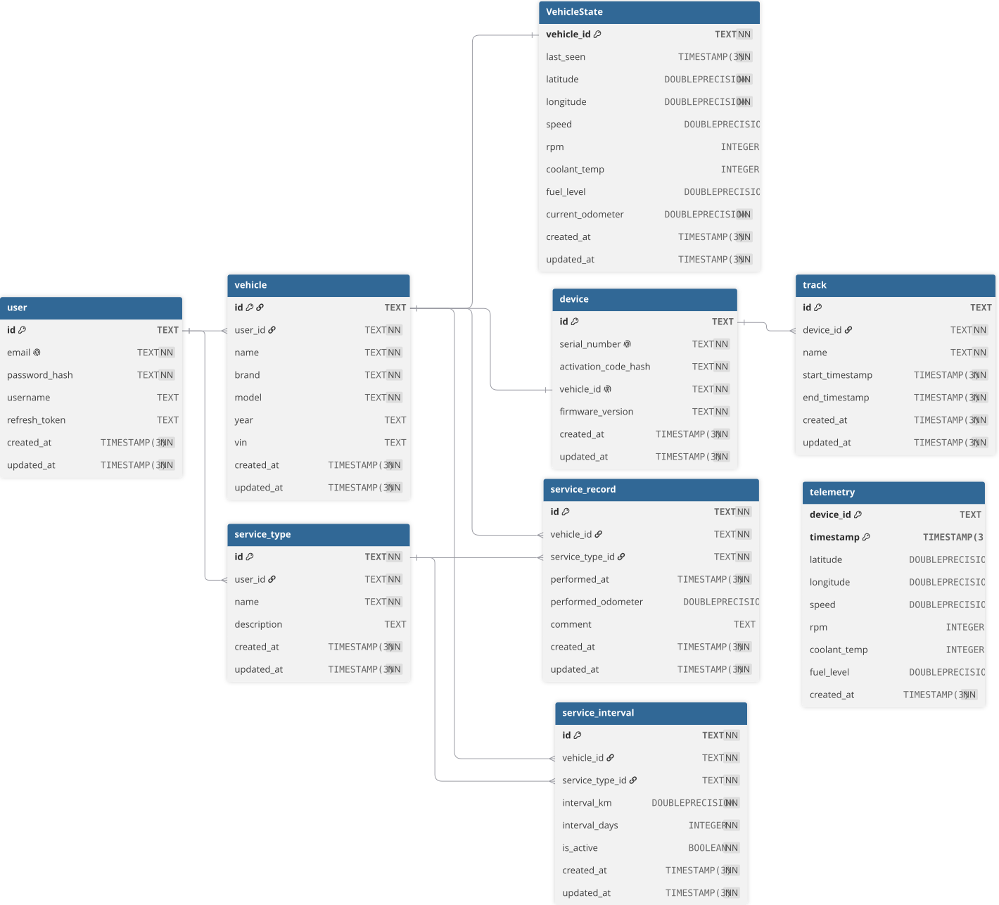

[](https://nestjs.com/)
[](https://www.prisma.io/)
[](https://www.postgresql.org/)
[](https://timescaledb.org/)
[](https://www.docker.com/)
[License](https://img.shields.io/badge/License-MIT-lightgrey)
# OBD-II Vehicle Tracker Backend

Backend API for an OBD-II vehicle tracking system built with **NestJS**, **Prisma**, **PostgreSQL**, and **TimescaleDB**.

The project is designed to efficiently process, store, and retrieve vehicle telemetry data while providing authentication, vehicle management, trip history, and maintenance tracking.

**Main feature:** Optimized storage and querying of time-series telemetry using TimescaleDB.

## Features

- JWT authentication
- Access & Refresh Tokens stored in HttpOnly Cookies
- Vehicle management
- OBD-II telemetry storage
- GPS track history
- Vehicle maintenance journal
- Pagination, sorting and searching
- Swagger API documentation
- Docker support
- Structured logging
- Global exception handling

## Tech Stack

- NestJS
- Prisma ORM
- PostgreSQL
- TimescaleDB
- JWT Authentication
- Swagger
- Docker

## Design Decisions

### Why TimescaleDB?

Vehicle telemetry is a classic time-series workload that can generate millions of records.

Instead of storing telemetry in a regular PostgreSQL table, the project uses TimescaleDB Hypertables, which provide:

- optimized storage for time-series data;
- faster time-range queries;
- efficient indexing;
- automatic chunking.

### Why VehicleState?

Fetching the latest telemetry record from millions of historical entries is unnecessary for most API requests.

The `VehicleState` table stores only the latest known state of each vehicle, allowing the application to retrieve current data with a single indexed query.

### Why Track doesn't reference Telemetry?

A trip only stores:

- startTimestamp
- endTimestamp

Telemetry points are retrieved by querying the Telemetry hypertable using the device ID and time range.

This avoids duplicated data and keeps the database normalized.
# Architecture

The project follows a layered architecture.

```text
Controller
    ↓
Service
    ↓
Repository
    ↓
Prisma
    ↓
PostgreSQL / TimescaleDB
```

Additional layers:

- DTO Validation
- Mappers
- Exception Filters
- Logging

## Architecture Diagram

```text
                   +----------------+
                   | React Frontend |
                   +--------+-------+
                            |
                      HTTPS / JWT
                            |
                            ▼
                  +------------------+
                  |  NestJS Backend  |
                  +------------------+
                     |     |      |
                     |     |      |
                  Prisma Logger Swagger
                     |
                     ▼
          PostgreSQL + TimescaleDB
```
# Project Structure

```text
prisma/
├── migrations/
└── schema.prisma
scripts/
└── setup-timescale.ts
src/
├── modules/
│   ├── auth/
│   ├── device/
│   ├── service-interval/
│   ├── service-record/
│   ├── service-type/
│   ├── telemetry/
│   ├── track/
│   ├── user/
│   ├── vehicle/
│   └── vehicle-state/
├── common/
│   ├── decorators/
│   ├── dto/
│   ├── filters/
│   ├── interceptors/
│   ├── mappers/
│   ├── middleware/
│   └── validators/
├── generated/
│   └── prisma/
└── prisma/
    ├── prisma.module.ts
    └── prisma.service.ts
```
# Database

The application uses PostgreSQL together with TimescaleDB.

## ER-Diagram



## Telemetry Optimization

The `Telemetry` table stores high-frequency vehicle data such as:

- GPS coordinates
- Vehicle speed
- Engine RPM
- Fuel level
- Coolant temperature
- Battery voltage
- OBD-II sensor values

Since telemetry is generated continuously, storing millions of records efficiently is critical.

To optimize performance, the project uses **TimescaleDB Hypertables**.

### Primary Key

```raw
(deviceId, timestamp)
```

Typical queries are optimized for:

- telemetry by device
- telemetry within a time range
- latest telemetry

Example:

```raw
GET /telemetry?deviceId=...&gte=...&lte=...
```
# Authentication

Authentication is implemented using JWT.

Two tokens are issued:

- Access Token
- Refresh Token

Both tokens are stored in **HttpOnly Cookies**.

Protected endpoints use NestJS Guards.
# Logging

The backend provides centralized request logging.

Implemented components:

- HTTP Request Middleware
- Response Logging Interceptor
- Execution Time Logging
- Prisma SQL Query Logging
- Automatic Request ID generation
- Global Exception Logging

Each request receives a unique `requestId` that appears in all related logs.

## Logging Flow

```text
Incoming Request
        │
        ▼
Generate requestId
        │
        ▼
Request Logger
        │
        ▼
Business Logic
        │
        ▼
Prisma Query Logger
        │
        ▼
Response Logger
        │
        ▼
Exception Filter (if needed)
```

# Error Handling

Global exception handling is implemented using:

- Global Exception Filter
- Prisma Exception Filter

This provides:

- consistent API responses
- centralized logging
- proper HTTP status codes
- Prisma error translation
# Vehicle Maintenance

The backend includes a maintenance journal.

Related entities:

- ServiceType
- ServiceRecord
- ServiceInterval

Features include:

- maintenance history
- service intervals
- scheduled maintenance tracking
# API Features

Most list endpoints support:

- pagination
- sorting
- searching

Swagger documentation is available for every endpoint.


## Request Flow

```text
  HTTP Request
        │
        ▼
  Middleware (Request ID)
        │
        ▼
  Authentication Guard
        │
        ▼
   Validation Pipe
        │
        ▼
    Controller
        │
        ▼
     Service
        │
        ▼
    Repository
        │
        ▼
     Prisma
        │
        ▼
  PostgreSQL / TimescaleDB
        │
        ▼
  Interceptor (Response Logging)
```
# Docker

The project includes Docker configuration.

Services:

- backend
- db (PostgreSQL + TimescaleDB)

The `backend` service is used for production and cannot be updated in real time on files change. The `db` service can be used along with `backend` or with local running server.

Run services:
```bash
docker compose up
```

## Running in production mode with docker:

Simply run services, and the server will be aviable at `localhost:3000`

```bash
git clone https://github.com/pavlo606/smart-can-backend.git

cd smart-can-backend

npm install

cp .env.docker.example .env.docker

docker compose up -d
```

## Running Locally in developer mode

To run locally you need to run the `db` service, but you need to shut down the `backend` service since it uses the same port, or you can change port in the `.env` file.

```bash
git clone https://github.com/pavlo606/smart-can-backend.git

cd smart-can-backend

npm install

cp .env.example .env

docker compose up db -d

npm run prisma:migrate

npm run setup:timescale

npm run start:dev
```
# API Documentation

Swagger is available after starting the application.

```raw
http://localhost:3000/api/docs
```
# Scripts

```bash
npm run start:dev          # Start development server
npm run build              # Build application
npm run start:prod         # Start production server
npm run prisma:generate    # Generate Prisma Client
npm run prisma:migrate     # Apply migrations
npm run setup:timescale    # Configure TimescaleDB hypertables
```
# Future Improvements

- WebSocket live telemetry
- Background jobs
- Redis caching
- Rate limiting
- Unit & Integration tests
- Metrics and monitoring

# Frontend

Frontend repository:

> https://github.com/pavlo606/smart-can-frontend

# Demo

Live demo:

> https://smart-can-frontend-production.up.railway.app/

Swagger documentation for API:

> https://smart-can-backend-production.up.railway.app/api/docs

# License

This project was developed as a Bachelor's degree project.